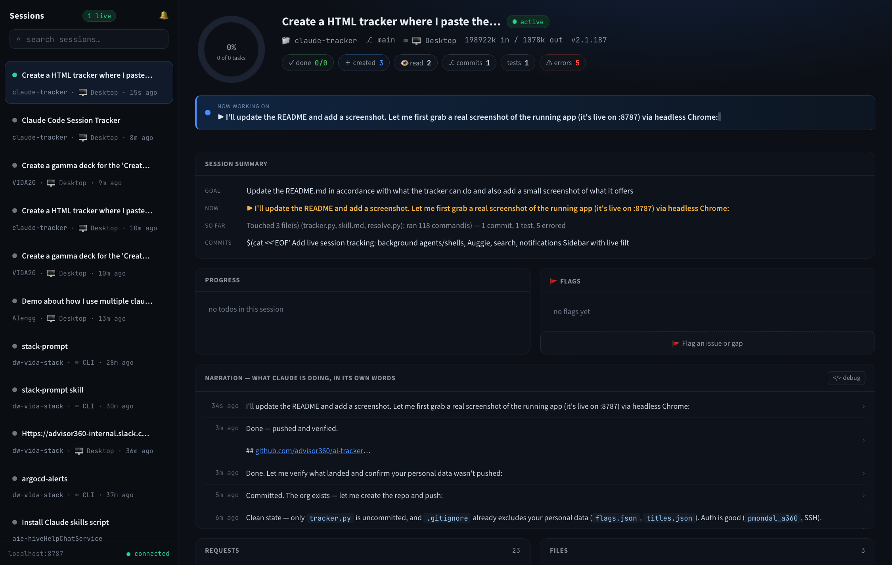

# AI Session Tracker

A zero-dependency, local web dashboard that shows you **what your AI coding sessions are doing — live**, across tools. It reads the session logs each AI coding tool already writes to disk and turns them into one readable view: a plain-language summary, todos, files touched, commands run, background agents/shells, and the assistant's own narration — refreshing every 2 seconds.

Works across tools via a small **provider** for each. Built in today: **Claude Code** and **Auggie / Augment**. Adding another is a ~2-function adapter (see [Adding a tool](#adding-a-tool)).

Nothing is sent anywhere. It's a single Python file using only the standard library, serving a local page you open in your browser.

<p align="center">
  
</p>

<p align="center"><sub>Live dashboard — session sidebar, summary (Goal / Now / So far), stat chips, background agents & shells, and the assistant's own narration.</sub></p>

---

## Installation

**Prerequisites:** **Python 3.8+**. That's it — the app is a single file using only the Python standard library, so there is **nothing to `pip install`** and no build step.

**Get the code:**

```bash
git clone https://github.com/mepritamm/ai-tracker.git
cd ai-tracker
```

(or just grab the standalone `dist/tracker.py` from a `make bundle` — one file, no install).

**Nothing else to configure.** The tracker auto-discovers your local session data:

- **Claude Code** → `~/.claude/projects/**/*.jsonl` (Desktop, CLI, and VS Code)
- **Auggie / Augment** → `~/.augment/sessions/*.json`

A tool only appears if its data exists on the machine — install nothing, it just lights up what you already have.

---

## Quick start

```bash
python3 -m aitracker
```

That's it. It starts a local server on **http://localhost:8787** and opens your browser. Pick a session from the sidebar (or paste a session id) and watch it work. If `8787` is already taken it automatically uses the next free port (and prints the one it picked).

Prefer the Makefile — it restarts cleanly (frees a stuck port so UI changes always take effect):

```bash
make serve            # start (or restart) the tracker on :8787
make stop             # stop it
make serve PORT=9000  # use a different port
make check            # the gate: --selfcheck + unit tests (must be green)
make test             # just the unit-test suite
make hooks            # install the pre-commit gate (blocks commits that fail check)
```

Flags: `python3 -m aitracker --version` · `--help`. Set a port without the Makefile: `PORT=9000 python3 -m aitracker`.

To keep it running in the background: `nohup python3 -m aitracker >/tmp/tracker.log 2>&1 &`.

---

## View it on your phone or tablet

Track your agents on the go. Reach the dashboard from a phone/tablet over a private **Tailscale** mesh, an **ngrok** tunnel, or your **LAN**; install it as a home-screen app (fullscreen, responsive phone/tablet layout); and require a password with `TRACKER_AUTH`. It's all opt-in — two env vars (`HOST`, `TRACKER_AUTH`), both off by default, so local use is unchanged.

**→ [Remote & mobile access setup](docs/remote-access.md)**

---

## What it shows

**Sidebar** — every session across all your tools and projects, newest first, each with a source badge (Claude Desktop / Claude CLI / Claude SDK / Claude VS Code / Auggie), a live dot, and a short title.
- **Background-agent sessions** (SDK-spawned, e.g. into a git worktree) are marked **🤖 Agent** and folded into a collapsible **🤖 Agents · &lt;repo&gt;** group per repo — so they don't bury your own sessions in the flat list. Click the group to expand its agents.
- **Click "N live"** to filter to only active sessions (live = touched in the last 5 minutes).
- **Search** by keyword — matches your prompts and the conversation (not the boilerplate); sessions whose *name* matches rank first.
- **✎ rename** any session to a title that means something to you (saved to `titles.json`).
- **📌 pin** any session to keep it at the top of the list, above recency (saved to `pins.json`).
- Sessions with notes show a **📝 N** badge (see the Notes panel below).

**Main view** for the selected session:
- **Session summary** — Goal, what it's doing *Now*, and a one-line "So far", with stat chips (files, commands, reads, commits, tests, tokens, git branch).
- **Decisions & open questions** — every question the session asked you (Claude `AskUserQuestion` / Auggie `ask-user`) with its options; **open** ones (awaiting your answer) are flagged and pinned to the top, decided ones show the choice you made. It's view-only — answer in the actual session (the tracker never writes to it).
- **Background agents & shells** — running ones shown; finished ones one click away. Click one to read its full prompt and narration/output; while it's still running that view stays live, refreshing in place every 2 s. A repo's spawned **agent sessions** are listed here too (with their worktree name) — live ones shown, finished ones behind a **Show N finished** disclosure — click **open ›** to jump straight into that agent's own session. Re-runs of the same agent (identical task) collapse into one row tagged **×N**, opening the latest run — so the count reflects distinct agents, not every retry. When one completes you get a toast + sound, plus a desktop notification if the tab is in the background (so you're alerted even while working elsewhere — allow notifications on first click; toggle with the 🔔 bell). *(Claude Code only — Auggie has no background-work model.)*
- **Pull requests** — the PRs a session actually *generated* (created via `gh pr create` or the GitHub MCP tool), as clickable links; PRs it merely referenced are left out.
- **Narration** — the assistant's own words, step by step, with full markdown rendering (tables, code, lists) in the pop-out modal, and prev/next arrows plus a jump-to-latest (⤒) button across every entry. History is unbounded — older entries page in from the server as you scroll. An open entry stays live: it follows the newest message, or holds your place if you've paged back into history.
- **Todos**, **Files** (a diff per edit, with GitHub-style **up/down context expansion** and an **Expand all** toggle to reveal the whole file around every edit, plus a Diff ⇄ Rendered-markdown toggle and an "open in new tab" button), **Commands** (with ✓/✗ for Claude), and **Prompts**. Files a background agent wrote — e.g. editing inside a git worktree — show too, tagged **🤖 agent**, and stay diffable.
- Every list panel loads a window and reveals older entries as you scroll to the bottom.
- **📝 Notes** — a per-session stack of plan-ahead notes: jot what you want to do once an answer lands (or while you wait on another session), and it stays with the session. Add as many as you like; **copy** one back when you need it, **remove** it when done. Sessions with notes carry a **📝 N** badge in the sidebar. Saved to `notes.json`, read live (no restart). Works for every session, any tool — and you can add notes from your phone or tablet too (unlike 🚩 flagging, which is local-only).
- **🚩 Flag** anything you want to fix later — see [Skills](#skills).

---

## How it works

Every supported tool writes an append-only session log to disk. The tracker only ever **reads** those files — there's no integration, no API key, and no network traffic.

1. **Serves** a single self-contained HTML page (`GET /`).
2. **Parses** a session's log on demand (`/api/session?id=…`) into one structured view.
3. The browser **polls** every 2 s — that re-read is the "live".

Each tool plugs in as a **provider** (a small adapter). The registry — `PROVIDERS` in `aitracker/registry.py` — merges every available provider's sessions into one list and routes each session id (namespaced by prefix, e.g. `auggie:`) to the adapter that owns it. One broken provider can't sink the list.

Both providers emit the **same result shape**, so the browser renders them identically. Where a tool records the data, the tracker surfaces it:

| Data | Claude Code | Auggie / Augment |
|------|-------------|------------------|
| Summary, todos, prompts, narration, files, tokens | ✅ | ✅ |
| Commands, reads, commits, tests | ✅ | ✅ (from `launch-process` / `view` tools) |
| Working folder + git branch (worktree-aware) | ✅ (from the log) | ✅ (folder from IDE state; branch from `.git/HEAD`) |
| Command exit status (✓/✗) | ✅ | ➖ Auggie stores none — commands show as ✓ |
| Pull requests — created **or** worked on | ✅ (created via `gh pr create` / MCP; worked-on = narrated about **and** in the session's own repo) | ✅ (Auggie logs no command output, so a created PR is tied to the first URL after `gh pr create`; worked-on = narrated about **and** in its own repo) |
| Decisions & open questions | ✅ (`AskUserQuestion`) | ✅ (`ask-user` — answer from the next turn's tool result) |
| Background agents & shells | ✅ | ➖ Auggie has no such model |

**Data files** — `flags.json` (your flags), `titles.json` (your renames), `pins.json` (pinned sessions), and `notes.json` (your notes) are read **live** (no restart). Everything else is baked into the page at startup, so **editing `aitracker/` or `web/` needs a server restart** to show.

---

## Supported tools

| Tool | Source on disk | Status |
|------|----------------|--------|
| **Claude Code** (Desktop / CLI / VS Code) | `~/.claude/projects/**/*.jsonl` | ✅ built in |
| **Auggie / Augment** | `~/.augment/sessions/*.json` | ✅ built in |
| Cursor, OpenAI Codex | SQLite databases | ⚙️ needs an adapter (format-specific reader) |
| GitHub Copilot CLI | binary LMDB blobs | ⚙️ needs an adapter |

Only tools that keep a **readable local transcript** can be adapted. Claude and Auggie write plain JSON/JSONL; others use SQLite or binary stores that each need their own reader.

## Adding a tool

Write one `Provider` in `aitracker/providers/` and register it in `aitracker/registry.py` — no core changes:

```python
class MyToolProvider(Provider):
    prefix = "mytool:"                     # namespaces this tool's session ids

    def available(self):                   # is the tool's data on this machine?
        return os.path.isdir(MY_TOOL_DIR)

    def list(self):                        # -> session summaries for the sidebar
        # return [{ "id": "mytool:<id>", "title", "project", "source": "mytool",
        #           "mtime", "prompt", "cwd" }, ...]
        ...

    def parse(self, sid):                  # full id -> the detail view dict
        # return the same shape parse_session()/parse_auggie() return
        ...

    def search(self, q):                   # optional keyword search
        return []

PROVIDERS = [ClaudeProvider(), AuggieProvider(), MyToolProvider()]
```

Add its source label to the `SRC` map in the page (e.g. `"mytool": "◆ MyTool"`) and it shows up with a badge, live status, search, and the full session view — same as the built-in tools.

---

## Skills

The repo ships Claude Code skills under [`.claude/skills/`](.claude/skills/). Invoke them in Claude Code with `/<name>`:

- **`/fix-flags`** — reads the issues you 🚩-flag in the app, investigates them against the real session data, fixes them, verifies with `--selfcheck`, and marks them resolved.
- **`/tracker-gap`** — add or uplift a capability at the **shared seam** so every provider (Claude, Auggie, …) inherits it — never a forked one-off. Ships a self-check assertion and proves it end-to-end.
- **`/tracker-push`** — the maintainer's commit-and-publish workflow (green self-check → commit → push), so a change ships without leaving the tree half-committed.

---

## Good to know

- **Restart to see UI/parse changes.** The page and parsers are loaded at startup; only `flags.json` / `titles.json` are read live. After editing `aitracker/` or `web/`, run `make serve` (or restart the process).
- **Auggie / Augment now reads the full local transcript** (`~/.augment/sessions/`) — summary, tokens, narration, files, commands, reads, working folder, and git branch — at near-Claude parity. The only gaps are background agents/shells (Auggie has no such model) and command exit status (Auggie doesn't record it, so its commands render as ✓).
- **"Live" is a 5-minute window** since the last activity. Background-agent completion is inferred from that window, so an agent-finished notification can lag a few minutes; background shells with real process state notify promptly.
- **Everything stays on your machine.** Read-only against the tool logs, no outbound network, no telemetry.

---

## Project layout

```
aitracker/                     the app package (stdlib only): providers/, web/, server, cli
web assets in aitracker/web/    index.html · app.css · app.js (inlined at serve time)
tests/                unit tests + evals — the mandatory gate
hooks/pre-commit               runs the gate before every commit (make hooks)
Makefile                       make serve / stop / check / test / hooks
docs/screenshot.png            the dashboard screenshot in this README
CLAUDE.md / AGENTS.md          context for AI agents working in this repo
.claude/rules/                 hard conventions for edits (single-file, no deps)
.claude/skills/fix-flags/      skill: fix issues you 🚩-flag in the app
.claude/skills/tracker-gap/    skill: add a capability at the shared seam
.claude/skills/tracker-push/   skill: commit + publish workflow
flags.json / titles.json / pins.json / notes.json   your local data (git-ignored)
```

## Testing (mandatory)

Every change must keep the gate green — the built-in `--selfcheck` **and** the `tests/`
suite (stdlib `unittest`, no deps): granular unit tests for the helpers plus end-to-end evals that
parse a fixture session and assert the whole derived view, so a break in any feature fails here.

```bash
make check     # run both — must be green before anything lands
make hooks     # once per clone: install the pre-commit hook that runs `make check`
```

With the hook installed, a commit is **blocked** until the gate passes. Add a test alongside any new
parser branch, helper, or provider (mirror the fixtures already in `_selfcheck()` / `tests/`).

---

Made with ❤️ in Bengaluru. Developed by [Pritam](https://tinyurl.com/pritamm93).
