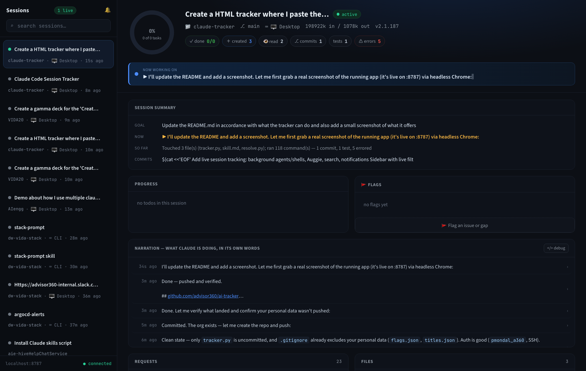

# AI Session Tracker

A local web dashboard that shows you **what your AI coding sessions are doing — live**, across tools. It reads the session logs each AI coding tool already writes to disk and turns them into one readable view: a plain-language summary, todos, files touched, commands run, background agents/shells, and the assistant's own narration — refreshing every 2 seconds.

Works across tools via a small **provider** for each. Built in today: **Claude Code** and **Auggie / Augment**. Adding another is a ~2-function adapter (see [Adding a tool](#adding-a-tool)).

Nothing is sent anywhere. The Python side uses only the standard library — nothing to install, no build step — and it serves a local page you open in your browser.

<p align="center">
  
</p>

<p align="center"><sub>Live dashboard — session sidebar, summary (Goal / Now / So far), stat chips, background agents & shells, and the assistant's own narration.</sub></p>

---

## Installation

**Prerequisites:** **Python 3.8+**. That's it — the Python side uses only the standard library, so there is **nothing to `pip install`** and no Python build step. Two front-end assets are vendored (committed files, never fetched at build time) and both load **lazily** — fetched only when the feature that needs them actually activates, never on page load: the terminal renders with a vendored copy of xterm.js by default (switch to the stdlib VT100 emulator instead with `TRACKER_TERM_RENDERER=grid`, or per terminal from the toolbar), and a vendored copy of mermaid.js draws ` ```mermaid ` fences as real diagrams (a hand-rolled SVG renderer covers a smaller family list instantly and stays as the offline/failure fallback — see [Narration](#what-it-shows) below).

**Get the code:**

```bash
git clone https://github.com/mepritamm/ai-tracker.git
cd ai-tracker
```

(or just grab the standalone `dist/tracker.py` from a `make bundle` — one file, no install; it ships
the dashboard but **not** the in-browser terminal, whose modules resolve each other through the real
package and don't survive being flattened into a single script).

**Nothing else to configure.** The tracker auto-discovers your local session data:

- **Claude Code** → `~/.claude/projects/**/*.jsonl` (Desktop, CLI, and VS Code)
- **Auggie / Augment** — three surfaces:
  - **Auggie CLI** → `~/.augment/sessions/*.json`
  - **Augment VS Code** extension → `~/Library/Application Support/Code/User/workspaceStorage/**/Augment.vscode-augment/`
  - **Augment Cursor** extension → `~/Library/Application Support/Cursor/User/workspaceStorage/**/Augment.vscode-augment/`

A tool only appears if its data exists on the machine — install nothing, it just lights up what you already have.

---

## Quick start

```bash
python3 -m aitracker
```

That's it. It starts a local server on **http://localhost:8790** and opens your browser. Pick a session from the sidebar (or paste a session id) and watch it work. If `8790` is already taken it automatically uses the next free port (and prints the one it picked, plus records it in `aitracker/port` so the notes drain hook can still find it).

Prefer the Makefile — it restarts cleanly (frees a stuck port so UI changes always take effect):

```bash
make serve            # run locally on http://localhost:8790 — no tunnel, no login (the default)
make stop             # stop the tracker (and any running tunnel)
make serve PORT=9000  # use a different port
make tunnel           # OPTIONAL — reach it from your phone via a Cloudflare tunnel (needs TRACKER_AUTH; see below)
make check            # the gate: --selfcheck + unit tests (must be green)
make test             # just the unit-test suite
make hooks            # install the pre-commit gate (blocks commits that fail check)
```

Flags: `python3 -m aitracker --version` · `--help`. Set a port without the Makefile: `PORT=9000 python3 -m aitracker`.

To keep it running in the background: `nohup python3 -m aitracker >/tmp/tracker.log 2>&1 &`.

**Local by default.** `make serve` binds to `localhost` only, with no login — nothing leaves your machine and no tunnel is involved. Reaching it from a phone is entirely **opt-in** (`make tunnel`, or the other options in the guide below); until you choose one, it stays localhost-only.

---

## View it on your phone or tablet

Locally it's just `make serve` (localhost, no tunnel, no login). To reach it from a phone, pick a connectivity option — a free **Cloudflare tunnel** (`make tunnel`; works through most corporate firewalls where ngrok/Tailscale are blocked), a private **Tailscale** mesh, an **ngrok** tunnel, or your **LAN** — then install it as a home-screen app (fullscreen, responsive phone/tablet layout) and require a password with `TRACKER_AUTH`. It's all opt-in — the tracker stays localhost-only until you choose one.

**→ [Remote & mobile access setup](docs/remote-access.md)**

---

## Terminal — on by default

The tracker normally only *reads*. Three features let it *start processes*, and are enabled by default. To disable them, set **`TRACKER_TERMINAL=0`**. `make serve`'s default `127.0.0.1` bind needs no password. But **binding beyond localhost requires `TRACKER_AUTH`** before the terminal will run — that covers `make tunnel` (which already mandates `TRACKER_AUTH` on its own) *and* `HOST=0.0.0.0 make serve` (LAN/Tailscale access, see [Remote & mobile access](docs/remote-access.md)): either one makes the terminal reachable off this machine, so without a password it would otherwise be an unauthenticated shell for anyone who can reach the port.

```bash
make serve                                    # terminal enabled, localhost only, no password needed
TRACKER_TERMINAL=0 make serve                # terminal disabled
make tunnel                                   # terminal enabled (requires TRACKER_AUTH)
HOST=0.0.0.0 make serve                       # terminal DISABLED until TRACKER_AUTH is also set
HOST=0.0.0.0 TRACKER_AUTH=user:pass make serve # terminal enabled (requires TRACKER_AUTH)
```

- **Terminal in the browser** — **▶ Open terminal here** and **⟲ Resume terminal here** open a real interactive terminal in a dialog, right in the page: a live PTY in the session's working directory, `claude --resume <id>` for the resume variant. If a terminal for that session is **already running** in the same mode — the ones **☰ Manage terminals** lists — the button surfaces *that* one in its own tab (the same thing its **peek** does) instead of starting a second one, so clicking twice can't leave you with two `claude --resume` processes on one conversation. A plain shell doesn't stand in for a resume, or the reverse: the match is on the session *and* the mode. Caveat: the check is client-side, so it dedupes repeat clicks within a page, not two browser tabs racing each other at the same instant. It runs full-screen programs — `vim`, `top`, Claude Code's own TUI — via a configurable terminal renderer, switchable per terminal from a toolbar control once it's open, or set as the startup default with `TRACKER_TERM_RENDERER=xterm` / `TRACKER_TERM_RENDERER=grid`. **xterm.js is the default** — vendored (a committed file, never fetched at runtime) and loaded lazily: the ~480KB library downloads only when a terminal is actually opened, never on page load. It's the stronger engine overall: correct **wide-character** width for CJK and emoji (the grid renderer's documented gap — it treats every codepoint as exactly one display column), **true colour and full 256-colour** support, and generally better VT fidelity, being a mature terminal engine rather than a stdlib emulator. The toolbar also carries a **☀️/🌙 theme toggle**, there because the terminal's full-screen overlay covers the top-bar one — it flips the same app-wide theme, and an already-open xterm pane re-themes live. The **grid** renderer — the same VT100 emulator in Python (stdlib only) that used to be the default — is still there on demand, and keeps a couple of things xterm doesn't: it **repaints in full on attach or reconnect** (the raw byte stream that feeds xterm, `/api/term/raw`, only tees bytes emitted *after* the stream opens, so a second tab or a reconnect shows a blank pane until the program's next write — switching a terminal *to* xterm has the same effect, so expect a blank pane there until something prints), and **server-backed scrollback** with the "▼ new output" badge and its own scrollbar (xterm keeps its own in-browser buffer instead). Mid-session server notices now reach both renderers as the same styled `.vtnotice` banner — owned by the mount point rather than either renderer, so switching renderers mid-session leaves it on screen untouched — with full replay for a viewer that attaches or reconnects after one fires: `/api/term/raw` carries it as a named `event: notice` frame on the same connection xterm already holds, alongside the `notices` key `/api/term/screen`'s JSON frame carries for the grid (`_feed_note()`'s inline `[ai-tracker] note: …` tee into the terminal's own scrollback still happens too, unrelated to the banner). The bell reaches both too, off one shared flash: xterm.js's own `onBell` event drives it there, the grid's SSE `bell` counter drives it here, but the visible pulse is the same function either way. The mouse-reporting toggle described below is grid-only — inert on xterm, which handles its own mouse input natively (drag-to-select still works there; it's xterm's own selection). It behaves like a real terminal: **scrollback** (mouse wheel; full-screen programs get arrow keys instead, and live output never yanks you back to the bottom while you're reading), **selection and copy/paste** (`Cmd+C` / `Ctrl+Shift+C` to copy — plain `Ctrl+C` always sends SIGINT; hold **Shift** and you get a native browser selection even while a full-screen program has mouse tracking on, the same escape hatch xterm itself offers), bracketed paste, cursor and bell, font zoom, **modified keys** (Ctrl/Shift/Alt/Meta combined with arrows, Home/End, Insert/Delete/Page Up/Page Down, and F1–F12, all encoded the way xterm encodes them; Alt+Enter sends the newline-without-submit form Claude Code expects instead of submitting; Ctrl+Space sends NUL — Ctrl+2..8 and Ctrl+/ are deliberately not implemented, since xterm's own reference doesn't pin them down clearly enough to guess), and **mouse reporting** (press, drag, release and wheel, forwarded to any program that turns it on — checked against a raw PTY capture of Claude Code v2.1.245 itself: any-motion tracking with SGR coordinates, plus focus reporting, are what it actually asks for, and all are now sent). **⤢ New tab** reopens the *same* shell full-window in its own browser tab.
- **New terminal / new session** — **+ New terminal** and **+ New Claude session** sit at the top of the sidebar, just above the session search. They aren't tied to a session: clicking either asks which directory to start in, offering your recent session working directories (most recent first) plus a free-text field. The first opens a plain shell there; the second starts a fresh `claude`, which then appears in the sidebar on its own.
- **How many terminals at once** — **12** by default (`TRACKER_MAX_TERMS`, clamped to 1–64). A cap exists because every live terminal pins a real child process, a reader thread and a screen buffer — but watching several sessions at once is the point of this app, so it is set well above what you're likely to need and it is not a dead end when you do hit it. Closing the dialog deliberately *detaches* rather than kills (that's what lets **⤢ New tab** reopen the same shell), so hitting the cap tells you exactly which terminals are holding the slots — each row names the session running in it (by title, falling back to project or a short id) instead of the identical `claude --resume <uuid>` every such row used to show, plus its project (the cwd's trailing segment, not the shared leading one) and age, with the full command and directory a hover away — with a **✕** on each that kills it and immediately opens the one you asked for. That same list is available on demand too, not only when you hit the cap: the sidebar's third button, **☰ Manage terminals** — badged with the live running count when the feature's reachable (no badge otherwise), read off the sidebar's own poll rather than a fetch of its own — opens a panel headed `N of <max> running` listing every live terminal the same way, with a **peek** (opens that terminal in its own tab, carrying its session so the model/effort switchers come along) and a **✕ kill** on each row, plus a **Close all** in the footer behind an inline confirmation (it kills every running terminal, including any Claude session inside one, and cannot be undone). Works from a phone or tablet like everything else here.
- **Model/effort switchers and context readout** — a slim bar under the terminal shows the session's current context usage and its cumulative total, plus a **model** button and an **effort** button that switch model or reasoning effort mid-session — effort's ladder is `low, medium, high, xhigh, max` (the CLI's own set; `high` is its default). Both buttons type `/model <name>` / `/effort <level>` into the running CLI, because those are CLI slash commands rather than anything the server can set — so they only appear when a Claude CLI is genuinely in the foreground of that pty right now, not merely when the terminal was *opened* for Claude: the server polls the pty's actual foreground process group (`GET /api/term/attached`) and reports not-attached, hiding the buttons, whenever it can't tell for sure. That means the switchers appear the moment you type `claude` into a plain shell and disappear the moment it exits, so a slash command can never land on a bash prompt. Context numbers come from the tool's **own** transcripts, not from scraping the screen; a percentage bar appears only when the tool records a context limit (Auggie does, Claude currently doesn't — so Claude sessions show the raw number rather than an invented percentage).
- **Resuming a running background agent — attach first, fork as fallback** — Claude Code sometimes refuses to `--resume` a session that is running as a background agent. The refusal's own wording changed under us, which is exactly what broke this feature once already: the legacy CLI said "is currently running as a background agent (bg)"; the current one instead says "is running as a background session (`<short-id>`). Run `claude attach <short-id>` to open it, or `claude stop <short-id>` first to resume it here. Add --fork-session to branch off a copy instead." The detector used to be pinned to the old string alone, so it silently stopped matching and the auto-recovery below just died — resume terminals sat on the refusal forever with no retry. `term_gate.BG_REFUSAL_MARKERS` now matches **both** wordings, and each is pinned by a test capturing the verbatim string, so a *third* rewording fails loudly instead of quietly disabling recovery again. The bigger change is that `claude attach <id>` now exists and is genuinely non-interactive — unlike bare `claude agents`, which is still just an interactive picker with no id argument. On a refusal the tracker retries with `claude attach <short-id>` **first**: the short id is read out of the refusal's own hint and cross-checked against the session id you actually clicked (so a pane replaying old scrollback can't trick it into attaching you to someone else's live agent), and attach hands back the **real, still-running session** — not a copy. `--fork-session` is demoted to a fallback, tried only if no attach target can be verified, the attach child can't be spawned, or the attach child itself later dies non-zero. The external-terminal (Terminal.app/iTerm) path carries the same ordering as a three-leg shell chain: `(<resume> || claude attach <short-id> || <resume> --fork-session)`. In the browser terminal the pane holds its `starting…` state across the *whole* recovery, so the connection isn't cut mid-swap — but don't overclaim invisibility: with the default xterm renderer (its raw byte stream has no `starting` gate to withhold behind) the refusal text is briefly visible before the swap; with the grid renderer, rows are withheld until the recovery concludes, so it never paints there. A successful attach settles after `ATTACH_SETTLE` (4.0s; measured 4.17s end to end, down from 8.05s before attach was preferred over fork). Measured separately: a genuine refusal prints ~2.05s in and the refused child exits ~2.61s in. The fork-lineage machinery is unchanged and still correct **for the fork fallback** — the snapshot taken just before the fork execs, the parent-uuid claim, the sidebar/detail banners and back-links, "leaves it unlinked rather than guessing" — but it's now scoped to that path only: an **attach** does not record fork lineage and deliberately shows no `⑂ fork` chip, because it's the same session, not a copy, and the chip's absence is itself the tell that you got the original conversation back. See [`docs/claude-resume-command-matrix.md`](docs/claude-resume-command-matrix.md) for the tested behaviour of every session state, including both refusal wordings and the new `claude attach`/`claude stop` help text.
- **Open in Terminal/iTerm instead** — the `↗ External terminal` / `↗ External resume` buttons launch your real macOS terminal app (`TRACKER_TERM_APP` picks Terminal or iTerm) `cd`'d to the session's directory. Local machine only; hidden when you're not on localhost. Resume is Claude-only; other tools get the `cd` alone.
- **Command runner** — runs line-oriented commands (`git status`, `make check`, `npm test`, …) in the session's directory and streams the output into the page with colour. There is **no shell**: the command is `shlex.split` into argv and `execvp`'d directly, so shell metacharacters are never operators. Commands must match an argv-prefix allowlist, overridable with `TRACKER_TERM_ALLOW`. Output is capped, concurrent jobs are capped, and a job is killed when you close its view.

### What these features do and don't guarantee

Worth reading, especially if you expose the server over a tunnel.

- **The in-browser terminal is an unrestricted shell, and it is reachable wherever the server is.** No allowlist applies to it — that is the whole point of the feature. Once `TRACKER_AUTH` is set, there is deliberately **no further loopback restriction**: it works over `make tunnel`, or `HOST=0.0.0.0`, on purpose. So on any server that's reachable beyond loopback, the terminal only runs once you've set `TRACKER_AUTH` (a loopback-only `make serve` needs neither), and from then on anyone who reaches the port and knows `TRACKER_AUTH` gets a shell as your user. **Treat `TRACKER_AUTH` with the seriousness you'd give a root password**, and rotate it if you expose it publicly.
- **"Local only" on the `↗` buttons is best-effort, not a guarantee.** That route refuses requests carrying a proxy's fingerprint (`X-Forwarded-For` and friends) and non-loopback peers. But `make tunnel` terminates on this machine and dials the server over loopback, so a peer address proves nothing on its own. The thing actually standing between a stranger and your machine is `TRACKER_AUTH`.
- **"No shell" is not "no code execution."** The allowlist deliberately includes commands that run project-supplied code: `make` runs your `Makefile`, `pytest` imports your `conftest.py`, `npm test` runs your scripts. That is the point of the feature, not a bug — but it means the runner is as trustworthy as the directory it runs in.
- **Running `git` inside a repository whose `.git/config` you don't control is code execution, by git's own design.** The runner neutralises the vectors it knows (external diff and textconv drivers, `core.fsmonitor`, `core.hooksPath`, pagers, `core.editor`) and refuses config-bearing flags, but git has many config-driven exec points and that list is not proven complete.
- **`cat` and `ls` are confined** to the session's own directory, so they can't read your keys.

---

## What it shows

**Sidebar** — every session across all your tools and projects, newest first, each with a source badge (Claude Desktop / Claude CLI / Claude SDK / Claude VS Code / Auggie / Augment VS Code / Augment Cursor), a live dot, and a short title.
- **Background-agent sessions** (SDK-spawned, e.g. into a git worktree) are marked **🤖 Agent** and folded into a collapsible **🤖 Agents · &lt;repo&gt;** group per repo — so they don't bury your own sessions in the flat list. Click the group to expand its agents.
- A session running **in-transcript background agents** (Task/Workflow subagents — which spawn no separate session) carries a **🤖 N running** badge, so you can see it's busy without opening it.
- **End-state at a glance** — a session **waiting on your answer** (an unanswered `AskUserQuestion` / Auggie `ask-user`) is flagged **⏳ answer** with an amber highlight so you know to go respond; one that **just completed its last run** (the last turn was the assistant finishing, within the live window) shows a subtle **✅ done** — gated to fresh completions so it flags what just landed rather than every stale session. Both work for every tool.
- **Click "N live"** to filter to only active sessions (live = touched in the last 5 minutes).
- **Search** by keyword — matches your prompts and the conversation (not the boilerplate); sessions whose *name* matches rank first.
- **✎ rename** any session to a title that means something to you (saved to `titles.json`).
- **📌 pin** any session to keep it at the top of the list, above recency (saved to `pins.json`).
- Sessions with notes show a **📝 N** badge (see the Plan-on-the-go panel below).
- Sessions with open flags show a **🚩 N** badge and a red edge, and the sidebar's own **🚩** button (next to the 🔔 bell) opens **every session's flags in one list** — each row names the session it belongs to and clicks through to it. Without it, a flag raised on a session you aren't currently looking at is invisible. Resolve / reopen / delete work from that list too, on any screen size.

**Main view** for the selected session — the header carries a progress ring, title, stat chips, a **🔍 search-this-session** toggle, and a **🚩 Flag an issue** toggle; below it the body splits into two halves, **◐ State** (progress, PRs, plan, decisions, summary) and **◑ Activity** (narration, prompts, files, commands), collapsing to one column on narrow screens. Every panel collapses to just its header — click the title (or the **▾/▸** chevron) to fold a panel away and focus on what you care about. A **☀️/🌙 theme toggle** next to the 🔔 bell switches between the default dark and a warm-beige light mode (remembered across visits); background agents & shells live in a right-side drawer. The 🚩 Flags panel is opt-in — the header toggle reveals it above the State/Activity split, and it opens by itself when the session you're viewing has an open flag.
- **Search within the open session** — the header **🔍** button reveals a full-width search card above the State/Activity split (like the Flags panel). It matches across this session's narration, prompts, files, commands and todos in one place; each hit shows a highlighted snippet and clicks through to the same pop-out modal (diff for files, output for commands, full text otherwise). Works for every tool.
- **Waiting, not idle** — when a session stopped on an unanswered question, the header reads **⏳ waiting on you · &lt;age&gt;** (amber) instead of "idle", and the banner says *Waiting on your answer*. Same signal as the sidebar's **⏳ answer**, so a blocked session never reads as merely stale. Works for every tool.
- **Session summary** — Goal, what it's doing *Now*, and a one-line "So far", with stat chips (files, commands, reads, commits, tests, tokens, git branch).
- **Decisions & open questions** — every question the session asked you (Claude `AskUserQuestion` / Auggie `ask-user`) with its options; **open** ones (awaiting your answer) are flagged and pinned to the top, decided ones show the choice you made. It's view-only — answer in the actual session (the tracker never writes to it).
- **Background agents & shells** — running ones shown; finished ones one click away. Click one to read its full prompt and narration/output; while it's still running that view stays live, refreshing in place every 2 s. A repo's spawned **agent sessions** are listed here too (with their worktree name) — live ones shown, finished ones behind a **Show N finished** disclosure — click **open ›** to jump straight into that agent's own session. Re-runs of the same agent (identical task) collapse into one row tagged **×N**, opening the latest run — so the count reflects distinct agents, not every retry. When one completes you get a toast + sound, plus a desktop notification if the tab is in the background (so you're alerted even while working elsewhere — allow notifications on first click; toggle with the 🔔 bell). *(Claude Code only — Auggie has no background-work model.)*
- **Pull requests** — the PRs a session actually *generated* (created via `gh pr create` or the GitHub MCP tool), as clickable links; PRs it merely referenced are left out. This includes PRs opened by the session's **background agents** — a subagent's `gh pr create` is attributed to the session and tagged **🤖 agent**, so agent-generated PRs don't vanish with the subagent. Each carries a **merged**/**closed** badge when the session's own logs reveal that state (a `Merge pull request #N` in git-log output, `gh pr merge/close N`, or the GitHub MCP merge) — so a landed PR no longer reads as perpetually "open"; otherwise it shows as open.
- **Narration** — the assistant's own words, step by step, with full markdown rendering (tables, code, lists) in the pop-out modal — each code block has its own one-click **⧉ Copy** button, and a ` ```mermaid ` fence is drawn as an actual **diagram** instead of raw source. Diagrams render for real, via a vendored, lazily-loaded copy of **mermaid.js** (v11.17.2, MIT — `aitracker/web/vendor/mermaid.min.js`; fetched only when a diagram is actually about to render, the same pattern the terminal's xterm.js uses) — so any diagram family mermaid.js itself understands is covered, not just a fixed list. Before that asset loads — or if it fails to (offline, blocked, or a source it can't parse) — a hand-rolled SVG renderer draws the diagram instantly and locally, no library involved, covering the families that actually turn up in agent-generated markdown: **flowcharts** (`flowchart`/`graph` — node shapes, edge labels, `classDef` colours), **sequence diagrams** (`sequenceDiagram` — participants, messages, self-loops, `Note over`/`left of`/`right of`, `alt`/`opt`/`loop`/`par` blocks with nesting), **state diagrams** (`stateDiagram`/`stateDiagram-v2` — states, `[*]` pseudostates, labelled transitions, aliased states, composite states flattened), **class diagrams** (`classDiagram` — classes with members, every relationship kind, cardinality on the edge), **ER diagrams** (`erDiagram` — entities with attributes, cardinality translated to readable prose), **user journeys** (`journey`/`userJourney` — sections with tasks and happiness-score faces), **pie charts** (`pie` — labelled slices with legend and percentages), and **quadrant charts** (`quadrantChart` — 2×2 axes with plotted points). Any other diagram type (🧜 mermaid: `gantt`, `mindmap`, `timeline`, `gitGraph`, `xychart-beta`, …) shows as tagged code — so the intent is visible rather than mistaken for a plain code fence — until mermaid.js is available, then upgrades to a real render like everything else. This holds anywhere markdown is rendered: narration, prompts, todos, notes, agent/shell output and the Rendered-markdown view of a `.md` file. Plus prev/next arrows and a jump-to-latest (⤒) button across every entry. History is unbounded — older entries page in from the server as you scroll. An open entry stays live: it follows the newest message, or holds your place if you've paged back into history.
- **Todos**, **Files** (a diff per edit, with GitHub-style **up/down context expansion** and an **Expand all** toggle to reveal the whole file around every edit, plus a Diff ⇄ Rendered-markdown toggle and an "open in new tab" button), **Commands** (with ✓/✗ for Claude), and **Prompts** (every prompt you typed, slash-command invocations like `/foo args` included). Files a background agent wrote — e.g. editing inside a git worktree — show too, tagged **🤖 agent**, and stay diffable.
- Every list panel loads a window and reveals older entries as you scroll to the bottom.
- **🧭 Plan on the go** — a per-session stack of small plan-ahead notes: jot what you want to do once an answer lands (or while you wait on another session), and it stays with the session. Add as many as you like; **copy** one back when you need it, **push** it into the live session, **remove** it when done.
  **▶ push** queues a note for delivery and the session collects it itself, so you never have to interrupt it or paste anything. The chip tells you *when* it will land, because that depends on what the session is doing: a **live** session picks it up the moment it finishes its current turn (**⏳ queued**); an **idle** one has no turn to finish, so it lands the next time you prompt or resume it (**⏳ queued · on wake**); a tool with no hook at all just holds it (**⏳ queued · copy it**). Delivery needs hooks — Claude Code has them; wire [`hooks/drain-notes.py`](hooks/drain-notes.py) into `Stop`, `UserPromptSubmit` and `SessionStart` (instructions in the file) and pushed notes arrive on their own. `Stop` alone only ever reaches a session that's mid-turn. Hooks are spawned by the AI tool, not by your shell, so they can't inherit your port or `TRACKER_AUTH` — the server writes both to `aitracker/port` and `aitracker/token` (owner-only) and the hook reads them. If a pushed note stays stuck at **⏳ queued**, read `aitracker/drain.log`: delivery is silent toward the session on purpose, but every *failed* attempt says why there. Tools without hooks (Auggie today) still queue, but you deliver by **⧉ copy**. Sessions with notes carry a **📝 N** badge in the sidebar. Saved to `notes.json`, read live (no restart). Works for every session, any tool — and you can add notes from your phone or tablet too, just like 🚩 flagging.
- **🚩 Flag** anything you want to fix later — see [Skills](#skills).

---

## Control Room — an alternate UI (opt-in)

A second UI sits alongside the dashboard above (which is unchanged apart from one entry point). Open it from the **✦ Try the new experience** button in the classic header, or by adding `?ui=next` to the URL (`?ui=classic` switches back); either way there's one click back to classic, any time, no reload. The choice persists in `localStorage` (`tracker.ui` = `classic` | `next`). It reads the same server data over the same shared seam — no server change, no build step, no new dependency.

- **A persistent top bar with three destinations — Board · Sessions · Terminals** — plus the session rail, stay on screen across views; neither used to survive opening a session. Inside an open session the rail collapses to a **56px orb rail** by default, letting you switch to another session with one click; the toggle button expands it back to full width on demand. The one place the rail *doesn't* show is the Sessions destination's own browse list (below) — it has no rail of its own since it already **is** the session browser.
- **Board** — the home view: the session rail down the side, a triage strip, and a board of tiles capped at **3–12 at once** (default 8, adjustable in the Config dialog's Board tab; pinned sessions first, then by state and recency — everything past the cap lives in the rail, not on the board). Every tile carries a "project · tool" sub-line under its title, shows the session's working directory, a short "what it's doing now" line, a done/total todo count, and — when the tool has recorded one — its **model** (e.g. `sonnet 4.5`), tacked onto the same trailing "age · tool" line. Every **Working**-state tile also gets an agent-coloured border and soft glow, not only tiles with a live background agent. A tile whose most recently completed command errored shows a **failing** state instead — `fail: <command>` — for Claude and Auggie sessions; the Augment extension has no readable command transcript to derive that signal from, so its sessions never show as failing. Rail rows carry the same directory + model detail, plus a **group-by** control: directory · activeness · last 24h · 7 days · 30 days · none.
- **Sessions** — a top-bar destination of its own: opens the last-opened (or most-recently-active) session with the rail present, or — when there's none — a browse list with a search box and **pagination** (10 / 25 / 50 per page). Its search goes through `/api/search`, the same server-side search the classic sidebar uses, rather than filtering the already-fetched session list client-side — `/api/list` caps at 200 sessions per provider, so a client-side filter would silently miss older ones.
- **Terminals** — the third top-bar destination; opens the same Manage-terminals panel the classic dashboard's ☰ button does, badged with the live running count.
- **Session detail** — full-width, three columns of panels, every one collapsed by default except the conversation timeline, which merges narration and prompts into a single chat-style thread (newest entries at the top) instead of two separate panels. The TIMELINE panel header carries four individually-selectable filter chips — **prompts**, **narration**, **tools**, **results** — alongside the existing all/talk-only presets, plus a **⤢** button to pop out the newest entry in the full-screen modal (or click any entry to open it); the same **openText()/_setNav()** modal the classic dashboard's narration pop-out uses. If the session's transcript has a line that failed to parse, the timeline says so — *"Couldn't read this session — the transcript exists but a line failed to parse. Everything before it is shown"* — instead of silently rendering a partial transcript as if it were complete (see the parity table above for the Claude/Auggie difference). Adds a **Links** panel, a **progress spine** across a session's todos, and — in the header's meta strip — the session's **model**; a background agent listed in the Agents panel carries its own model too, which can (and does) differ from its parent session's. The header also shows **pinned** state and, when the session has any, its **open-flag count**, plus a permanent **stat chips** row (files · commands · reads · commits · tests · tokens · branch) — always visible on desktop, with no Config toggle any more, and hidden below the 600px phone breakpoint since the phone layout omits it. The Evidence column's **Terminal controls** panel — the model/effort switchers and context readout described under [Terminal](#terminal--on-by-default) — only renders when a live Claude CLI is actually the foreground process of an open terminal for that session, reusing the same check `/api/term/attached` already answers rather than a second implementation.
- **Theme** follows `prefers-color-scheme` live — a three-way **Auto / Light / Dark** control, with a persisted manual override (`tracker.theme` = `auto` | `light` | `dark`) — independent of the classic dashboard's own theme toggle. Emoji are recoloured to match the active theme's palette (a CSS filter chain — grayscale, then a hue-rotate onto the theme's ink colour) rather than rendering in their native colours.
- **Terminal** — the same PTY plumbing as the classic dashboard in new chrome (`ExtVT.mountInto()` hosts it inline rather than a second terminal implementation). xterm.js still loads lazily, only once a terminal is actually opened. The overlay traps focus while open and restores it to whatever had focus before opening, the same as every other Control Room dialog.
- **Help and Config are dialogs, not routes.** Config's own preferences — theme, session rail (Auto / Open / Collapsed), cards-start-folded, desktop notifications + sound, **board tiles** (a 3–12 slider, default 8, client-side only), poll interval — are live browser settings that save as you change them. Below them, the real running parameters — **LIVE_WINDOW, terminal renderer, max terminals, terminal on/off, terminal app, and the command allowlist** — are now genuinely editable from the dialog (`GET`/`POST /api/config`), not just displayed: they persist to a gitignored `config.json`, read live (no restart needed), with precedence `config.json` > environment variable > built-in default. **PORT** and **HOST** are read-only display fields in the dialog, each labelled "takes effect on restart" — rebinding a live listening socket isn't attempted, so the row just reflects what the server is currently running with; the **terminal on/off** setting carries the same restart note. **`TRACKER_AUTH` is deliberately excluded from all of this** and still shows only as set/not-set — writing a password typed into a web form into a plaintext file on disk would be a real security regression, not a convenience.
- **A Tunnel section**, in the same dialog, shows the tunnel URL (`GET /api/tunnel`) plus a username/password masked by default and revealed on demand (`GET /api/tunnel/reveal`); editing either (`POST /api/tunnel`) prints a copyable restart command, since a new credential only takes effect on the next `make tunnel`, plus a copyable share URL in `user:pass@host` form for your own notes. `config.json` is written mode `0600` and the reveal route sits behind the app's own auth — but the credential is still stored in **plain text** on this machine, same as `TRACKER_AUTH` itself; treat it the same way.
- **Mobile / tablet.** The top bar wraps at narrow widths, every destination stays reachable, touch targets — including the back button — are 44px at phone width, and the rail becomes an overlay drawer below 1024px. Session detail gets its own phone layout at every width up to 600px (no dead band with a duplicate back-nav or a missing compose bar in between): a back chevron + ellipsed breadcrumb status bar, a 34px presence orb with the live narration set in serif type just below it, and — when the session is waiting on you — an awaiting-question card ahead of the folded State and Evidence columns. An open flag's own text is shown directly on the flag card, not hidden behind hover.
- **Known gaps** — stopping a running session, and switching a terminal's model/effort, are disabled here with copy explaining why: no server route exists for either yet (the classic dashboard's own switchers still work — see [Terminal](#terminal--on-by-default) above).

---

## How it works

Every supported tool writes an append-only session log to disk. The tracker only ever **reads** those files — there's no integration, no API key, and no network traffic.

1. **Serves** a single self-contained HTML page (`GET /`).
2. **Parses** a session's log on demand (`/api/session?id=…`) into one structured view.
3. The browser **polls** every 2 s — that re-read is the "live".

Each tool plugs in as a **provider** (a small adapter). The registry — `PROVIDERS` in `aitracker/registry.py` — merges every available provider's sessions into one list and routes each session id (namespaced by prefix, e.g. `auggie:`) to the adapter that owns it. One broken provider can't sink the list.

All providers emit the **same result shape**, so the browser renders them identically. Where a tool records the data, the tracker surfaces it:

| Data | Claude Code | Auggie CLI | Augment VS Code / Cursor extension |
|------|-------------|------------|------------------------------------|
| Summary, todos, prompts, narration, files, tokens | ✅ | ✅ | ➖ **todos + files touched only** — the chat transcript lives in a per-workspace LevelDB (`augment-kv-store`) the tracker can't read stdlib-only. The narration panel says so honestly, then shows what IS on disk. |
| Commands, reads, commits, tests | ✅ | ✅ (from `launch-process` / `view` tools) | ➖ (in LevelDB, same reason) |
| Working folder + git branch (worktree-aware) | ✅ (from the log) | ✅ (folder from IDE state; branch from `.git/HEAD`) | ✅ folder (from `workspace.json`); ➖ branch |
| Command exit status (✓/✗) | ✅ | ➖ Auggie stores none — commands show as ✓ | ➖ n/a |
| Control Room board "failing" tile signal (`fail: <command>`) | ✅ (Bash tool_use/tool_result join, in the existing bounded tail scan) | ✅ (same join over `chatHistory`) | ➖ no readable transcript to derive pass/fail from — never shown as failing |
| Pull requests — created **or** worked on | ✅ (created via `gh pr create` / MCP; worked-on = narrated about **and** in the session's own repo) | ✅ (Auggie logs no command output, so a created PR is tied to the first URL after `gh pr create`; worked-on = narrated about **and** in its own repo) | ➖ n/a |
| Decisions & open questions | ✅ (`AskUserQuestion`) | ✅ (`ask-user` — answer from the next turn's tool result) | ➖ n/a |
| Background agents & shells | ✅ | ➖ Auggie has no such model | ➖ n/a |
| Progress spine (Control Room's todo bar) | 🟡 equal-width today, for every provider — the backend does compute an exact `started_at`/`ended_at` join to the task store by id, but the renderer reads camelCase `startedAt`/`endedAt`, a name nothing ever writes, so that join never reaches the screen yet | 🟡 same on-screen result — the backend's own join here is only an approximate name-match anyway (would render as "inferred time" once wired) | 🟡 same on-screen result — no timing source exists to join in the first place |
| Markdown rendering, incl. ` ```mermaid ` fences drawn as diagrams | ✅ | ✅ (shared renderer — one seam, both sources) | ✅ (same shared renderer) |
| 📝 Notes — write, ⧉ copy, 📝 N badge | ✅ | ✅ | ✅ |
| ▶ push a note into the session | ✅ live → next turn-end; idle → next prompt/resume (`Stop` + `UserPromptSubmit` + `SessionStart` hooks) | ➖ queues fine, but Auggie has no hooks to deliver it — use ⧉ copy | ➖ same — no hook, use ⧉ copy |
| Degraded-transcript notice ("Couldn't read this session — a line failed to parse, everything before it is shown") | ✅ reports the failing line **number** (1-based JSONL line) | 🟡 reports the same notice, but with **no line number** — Auggie's task-storage is a family of separate files, not one file with lines; a session whose file is corrupt *outright* (fails to parse at all) is dropped from the list entirely and reads as **missing**, not degraded — a known gap | ➖ n/a |

**Data files** — `flags.json` (your flags), `titles.json` (your renames), `pins.json` (pinned sessions), `notes.json` (your notes), and `config.json` (Control Room's editable settings + staged tunnel credentials) are read **live** (no restart). Everything else is baked into the page at startup, so **editing `aitracker/` or `web/` needs a server restart** to show.

---

## Supported tools

| Tool | Source on disk | Status |
|------|----------------|--------|
| **Claude Code** (Desktop / CLI / VS Code) | `~/.claude/projects/**/*.jsonl` | ✅ built in |
| **Auggie CLI** | `~/.augment/sessions/*.json` | ✅ built in |
| **Augment VS Code extension** | `~/Library/Application Support/Code/User/workspaceStorage/**/Augment.vscode-augment/` (JSON) + LevelDB (skipped) | ✅ built in (todos + files touched; chat transcript degraded — see the parity table above) |
| **Augment Cursor extension** | `~/Library/Application Support/Cursor/User/workspaceStorage/**/Augment.vscode-augment/` (JSON) + LevelDB (skipped) | ✅ built in (same as VS Code) |
| Cursor's own AI, OpenAI Codex | SQLite databases | ⚙️ needs an adapter (format-specific reader) |
| GitHub Copilot CLI | binary LMDB blobs | ⚙️ needs an adapter |

Only tools that keep a **readable local transcript** can be adapted. Claude, Auggie CLI, and the JSON portion of the Augment extensions write plain JSON/JSONL; others use SQLite or binary stores that each need their own reader (the extensions' chat transcript is one such binary store — LevelDB — which is why those two rows sit at partial parity rather than full).

## Adding a tool

Write one `Provider` in `aitracker/providers/` and register it in `aitracker/registry.py` — no core changes:

```python
class MyToolProvider(Provider):
    prefix = "mytool:"                     # namespaces this tool's session ids

    def available(self):                   # is the tool's data on this machine?
        return os.path.isdir(MY_TOOL_DIR)

    def list(self):                        # -> session summaries for the sidebar
        # return [{ "id": "mytool:<id>", "title", "project", "source": "mytool",
        #           "mtime", "prompt", "cwd" }, ...]
        ...

    def parse(self, sid):                  # full id -> the detail view dict
        # return the same shape parse_session()/parse_auggie() return
        ...

    def search(self, q):                   # optional keyword search
        return []

PROVIDERS = [ClaudeProvider(), AuggieProvider(), MyToolProvider()]
```

Add its source label to the `SRC` map in the page (e.g. `"mytool": "◆ MyTool"`) and it shows up with a badge, live status, search, and the full session view — same as the built-in tools.

---

## Skills

The repo ships Claude Code skills under [`.claude/skills/`](.claude/skills/). Invoke them in Claude Code with `/<name>`:

- **`/fix-flags`** — reads the issues you 🚩-flag in the app, investigates them against the real session data, fixes them, verifies with `--selfcheck`, and marks them resolved.
- **`/tracker-gap`** — add or uplift a capability at the **shared seam** so every provider (Claude, Auggie, …) inherits it — never a forked one-off. Ships a self-check assertion and proves it end-to-end.

The maintainer also runs `/tracker-push` (green self-check → commit → push) locally — it's a `.gitignore`d, local-only skill (the maintainer's own dual-remote/license-split publish policy), so it isn't part of the public tree and won't appear in a fresh clone.

---

## Good to know

- **Restart to see UI/parse changes.** The page and parsers are loaded at startup; only `flags.json` / `titles.json` / `pins.json` / `notes.json` / `config.json` are read live. After editing `aitracker/` or `web/`, run `make serve` (or restart the process).
- **Auggie CLI** reads the full local transcript (`~/.augment/sessions/`) — summary, tokens, narration, files, commands, reads, working folder, and git branch — at near-Claude parity. The only gaps are background agents/shells (Auggie has no such model), command exit status (Auggie doesn't record it, so its commands render as ✓), and **▶ push** delivery (Auggie has no hooks — the note still queues, you deliver it with ⧉ copy).
- **Augment VS Code / Cursor extensions** are read from per-workspace IDE storage (`workspaceStorage/**/Augment.vscode-augment/`) — **todos + files-touched only**, honestly degraded. The chat transcript lives in an `augment-kv-store` LevelDB that stdlib can't decode, so the narration panel says exactly that instead of pretending it's empty. Everything the SPA does render (todos, files, source badge, live filter, search, 📝 notes, 🚩 flags, rename, pin) works for these sessions the same way it does for the other two.
- **"Live" is a 5-minute window** since the last activity. Background-agent completion is inferred from that window, so an agent-finished notification can lag a few minutes; background shells with real process state notify promptly.
- **Everything stays on your machine.** Read-only against the tool logs, no outbound network, no telemetry.

---

## Project layout

```
aitracker/                     the app package (Python stdlib only): providers/, web/, server, cli
aitracker/web/vendor/          vendored assets: xterm.js + xterm.css (MIT; default terminal renderer,
                               lazy-loaded) and mermaid.js (MIT, v11.17.2; real diagram rendering,
                               lazy-loaded — see Narration above)
web assets in aitracker/web/    index.html · app.css · app.js (inlined at serve time)
aitracker/web/ext_cr_*          Control Room (opt-in alternate UI): boot/board/detail/dialogs/term
                               modules + ext_cr.css (design tokens) — auto-inlined like the rest
tests/                unit tests + evals — the mandatory gate
tests/test_page_bundle.py     runs the assembled page's bundled JS under a stub DOM in Node,
                               catching a load-time throw in any web/*.js that would blank the
                               whole dashboard (skips cleanly if node isn't installed)
tests/test_page_css.py        assembled-page CSS integrity — unbalanced comments/braces, a stray
                               comment terminator, or a rule that didn't survive assembly
tests/test_cr_logic.py        Control Room's pure JS derivations (board state, rail grouping,
                               progress-spine segments, …) run under Node
tests/test_cr_routes.py       GET/POST /api/config — the editable-settings allowlist, validators,
                               and config.json > env > default precedence
tests/test_cr_tunnel.py       the Tunnel section's routes — masked vs. revealed reads, the 0600
                               file mode, and the auth gate on /api/tunnel/reveal
tests/test_cr_rail_toggle.py   the session rail's tri-state preference (auto/open/collapsed), the
                               Config-to-board cr:pref sync, and the legacy-key migration guarantee
tests/test_capability_table.py  Control Room's Help-dialog capability count stays derived from the
                               same list the test asserts against, never a stale hand-typed number
tests/test_cr_timeline.py     TIMELINE panel fixes: newest-first ordering, the four filter chips
                               (prompts/narration/tools/results), and pop-out reusing openText()/_setNav()
tests/test_cr_parse_error.py  the `parse_error` field on the detail dict — present (null or not)
                               for every provider; Claude's carries a line number, Auggie's doesn't
hooks/pre-commit               runs the gate before every commit (make hooks)
hooks/drain-notes.py           optional Claude Code hook: delivers ▶ pushed notes (3 events)
Makefile                       make serve / stop / check / test / hooks
docs/screenshot.png            the dashboard screenshot in this README
CLAUDE.md / AGENTS.md          context for AI agents working in this repo
.claude/rules/                 hard conventions for edits (Python stdlib only, shared seam)
.claude/skills/fix-flags/      skill: fix issues you 🚩-flag in the app
.claude/skills/tracker-gap/    skill: add a capability at the shared seam
                               (tracker-push, the maintainer's publish skill, is gitignored —
                               local-only, not part of this tree — see Skills above)
flags.json / titles.json / pins.json / notes.json / forks.json   your local data (git-ignored)
config.json                    Control Room's editable settings + staged tunnel credentials
                               (mode 0600), read live — see Config/Tunnel above, git-ignored
port / token / drain.log       where the server is, a local credential for the drain hook,
                               and why a push failed — all runtime, all git-ignored
```

## Testing (mandatory)

Every change must keep the gate green — the built-in `--selfcheck` **and** the `tests/`
suite (stdlib `unittest`, no deps): granular unit tests for the helpers plus end-to-end evals that
parse a fixture session and assert the whole derived view, so a break in any feature fails here.

```bash
make check     # run both — must be green before anything lands
make hooks     # once per clone: install the pre-commit hook that runs `make check`
```

With the hook installed, a commit is **blocked** until the gate passes. Add a test alongside any new
parser branch, helper, or provider (mirror the fixtures already in `_selfcheck()` / `tests/`).

---

Made with ❤️ in Bengaluru. Developed by [Pritam](https://tinyurl.com/pritamm93).
